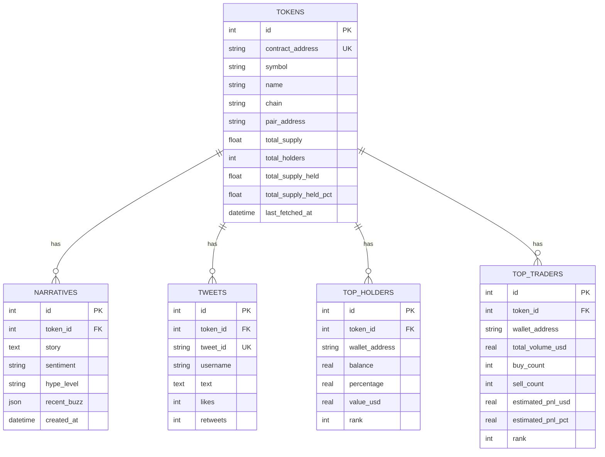

# 🏛️ Architecture & System Design

This document details the architectural boundaries, end-to-end data flows, and subsystem responsibilities of Memecoin Intel.

---

## 1. High-Level System Diagram

```mermaid
flowchart TD
    subgraph Browser ["Frontend Client (Vanilla JS/CSS)"]
        UI[index.html]
        APP[js/app.js]
        CSS[css/styles.css]
    end

    subgraph Backend ["FastAPI Backend (Python 3.13)"]
        API[main.py Router]
        RAM[services/cache.py (RAM TTL)]
        REPO[repositories/token_repository.py]
        RPC[services/holders_traders.py]
        DEX[services/dexscreener.py]
        SOC[services/social.py & twitter_search.py]
        AI[services/summarizer.py (Gemini 2.0 Flash)]
    end

    subgraph Storage ["Persistent Database"]
        DB[(SQLite WAL: backend/data/app.db)]
    end

    subgraph Blockchains ["Direct Blockchain Nodes (JSON-RPC)"]
        RH[Robinhood Chain: 4663]
        INK[Ink Chain: 57073]
        SOL[Solana Mainnet]
        EVM[Base / ETH / BSC / Arbitrum / Polygon]
    end

    UI -->|User Input / Poll| APP
    APP -->|REST HTTP| API
    API --> RAM
    API --> REPO
    REPO --> DB
    API --> RPC
    API --> DEX
    API --> SOC
    API --> AI
    RPC -->|eth_call / getLogs| RH
    RPC -->|eth_call / getLogs| INK
    RPC -->|getTokenSupply| SOL
    RPC -->|eth_call / getLogs| EVM
```

---

## 2. End-to-End Execution Flows

### Flow A: Token Analysis Query (`GET /api/token/{contract}`)
1. **Frontend**: User enters contract address or clicks watchlist item. `app.js` issues `GET /api/token/{contract}`.
2. **Tier 1 (RAM)**: Check `analysis_cache` (600s TTL). If present, return immediately (`cached_source: "ram"`).
3. **Tier 2 (SQLite)**: Query `db_get_token_intel(contract)`. If token and narrative exist in SQLite:
   - Make a lightweight call to `dexscreener.py` for live price and liquidity (0 API credits).
   - Inject cached narrative, tweets, and supply stats. Return (`cached_source: "sqlite"`).
4. **Tier 3 (Fresh Ingestion)**:
   - Call DexScreener API for token metadata and market pairs.
   - Query SocialData API / DuckDuckGo for tweets and web articles.
   - Invoke Gemini 2.0 Flash (`summarizer.py`) to generate story, hype level, buzz, and risk signals.
   - Atomically persist to SQLite via `save_token_intel()` so all subsequent queries are instant.

---

### Flow B: On-Chain Wallet Analytics (`GET /api/token/{contract}/holders` & `/traders`)
1. **Frontend**: Triggered concurrently upon token load or user clicking "Refresh On-Chain".
2. **SQLite Cache Check**: `token_repository.get_top_holders(token_id)` loads previous snapshot.
3. **Direct RPC Query** (if `refresh=true` or cache miss):
   - **Total Supply**:
     - EVM: `eth_call` to `0x18160ddd` (`totalSupply()`) and `0x313ce567` (`decimals()`).
     - Solana: `getTokenSupply`.
   - **Top Holders**:
     - EVM: `eth_getLogs` for `Transfer` events (`0xddf252ad...`) across recent blocks, aggregated into account balance maps.
     - Solana: `getTokenLargestAccounts`.
   - **Concentration**:
     - Sum balances of top holders -> `total_supply_held`.
     - `(total_supply_held / total_supply) * 100` -> `total_supply_held_pct`.
   - **Save & Return**: Snapshot saved atomically into `tokens` and `top_holders` tables.

---

## 3. Supported Chains & RPC Configurations

```python
RPC_URLS = {
    "solana": "https://api.mainnet-beta.solana.com",
    "ethereum": "https://eth.llamarpc.com",
    "base": "https://mainnet.base.org",
    "bsc": "https://binance.llamarpc.com",
    "arbitrum": "https://arb1.arbitrum.io/rpc",
    "polygon": "https://polygon-rpc.com",
    "robinhood": "https://rpc.robinhood.com",
    "ink": "https://rpc-gel.inkonchain.com",
}
```

---

## 4. Database ER Architecture


